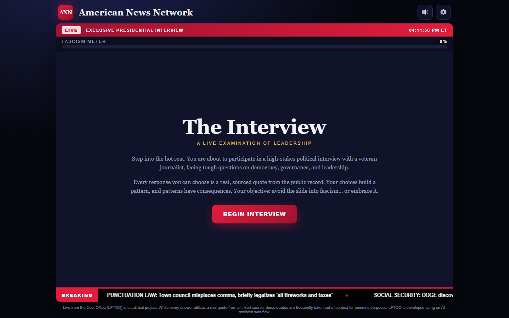
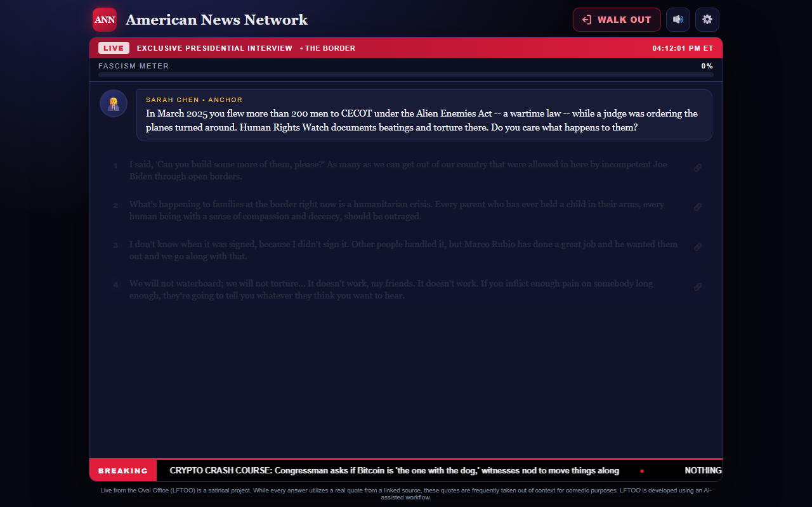

# Live from the Oval Office

**A satirical choose-your-own-interview.** You are the President of the United States, live on the American News Network, and anchor Sarah Chen has questions. Every answer you can give is a real, sourced quote from an American politician. Pick your words, watch the Fascism Meter, and see how the night gets written up.

Most lines are Trump's. Cabinet members and allies (Hegseth, Rubio, Bondi, Noem, Leavitt, Vance, RFK Jr., Musk, Greene, Graham, Johnson, Cruz) supply the absurd end; Obama, Biden, the Clintons, Sanders, McCain, Bush, Romney, Pence, Cheney, Pelosi and Rand Paul supply the tame end. Speakers are not labelled in-game; the source link on each answer tells you who said it and where. Some quotes are lifted out of context for the joke.

**Play:** open `index.html` (no build step, works from `file://` and GitHub Pages).

## What's in a round
- A random opening (one of five), then 5 topics drawn at random from 23 (2020 election, the press, tariffs, DOGE, Epstein, Ukraine, Iran, troops in cities, immigration, executive power, the Big Beautiful Bill, the economy, the culture war, Truth Social and AI, political violence, fitness for office, and more), then one of five finals.
- Each topic branches: your answer decides the follow-up, two to three questions deep. Questions can store up to six answers but show at most four, always including a low-score and a high-score one.
- A meltdown interrupt if the meter runs hot, then a final question and the results screen.
- A "Walk out" button in the header: the President insults the anchor with a real line and leaves the set, and you are back at the studio screen.
- Settings (gear icon): text speed (incl. instant), speech / music / SFX volume, mute. `Enter` skips the typing, `1`-`4` pick answers. Settings persist in localStorage.
- Procedural breaking-news music and sound effects via Web Audio; no asset files.

## Files
| Path | What |
|---|---|
| `index.html`, `styles.css` | markup and theme |
| `game.js` | engine: flow, typing, scoring, results |
| `audio.js` | music loop, blips, clicks, stings |
| `data/core.js` | openings, finals, meltdown, endings |
| `data/news.js` | ticker headlines |
| `data/topics/*.js` | one topic tree per file |
| `tools/validate.js` | schema + graph check for topics |
| `tools/checksources.js` | fetches every source URL and greps it for the quote |
| `tools/import.js` | wraps topic JSON as `data/topics/*.js` |

## Adding content
See `CONTENT_GUIDE.md`. Short version: real quotes only, one source URL each, optional `who` for non-Trump speakers, the question must read as something every option under it answers, run `node tools/validate.js` and `node tools/checksources.js` before opening a PR. Sources that return 403/406 to bots (Reuters, The Hill, Forbes, RealClearPolitics) are listed in the checker report as `HTTP`; confirm those by hand.

## Scoring
Each option carries 0-10 fascism points and a category (press, truth, elections, power, violence, dehumanization, cronyism, strongman). The meter is points earned over points possible. Endings: under 15% Constitutional Custodian, under 30% Norm Bender, under 50% Democratic Backslider, under 70% Strongman in Training, else Authoritarian Collapse.
